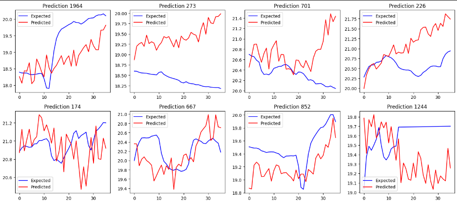
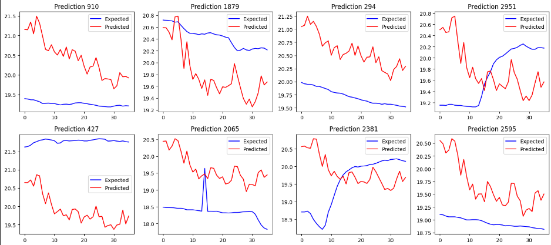

# Maticas Tech AI

In this repository we develop over the Maticas AI branch, with the data collected in the _first official iteration of Maticas Tech_ and other datasets.

The main tasks we currently focus on are time series forecasting for environmental variables such as temperature, humidity and lux. 


## About the feature set used until now

We are using cyclic encoding for time variables such as hour of the day and day of the year.

In our most advanced feature set we are using the magnitude of the different variables in the specific timestamp, cyclic encoding for the hour of the day and day of the year. With some others rolling features such as 'min', 'max', 'std' and 'avg' usually on a 10 min - 15 min window size.

- On this field of previous feature engineering we still have work to be done such as:
    -  We need a feature set like 'mean', 'max', 'min', 'std', 'cummulative' temperature _(for naming an example)_ over the $n-th$  ours of the day, over the last $x$ days. 

    - It's also important to explore a way of filtering out previously features which won't give too much value to the model, so that model size or required previous computation to get the features can be reduced.

To get hands on over the data preprocessing task you can head to [add_features.py](./utils/add_features.py) that is the place where most of the magic happens.

## Work done so far

Up until now we've tested some architectures and got interesting results using Tensorflow, all the models implemented take information from different variables and predict one single variable:

1. In the file [3_test.ipynb](./3_test.ipynb) we develop a bidirectional GRU stack followed by 1D convolutions to extract extra features in order to predict 3h ahead into the future by using an input window size of 4h aprox. 

    

    And got this results for the data: 

    ```bash
    mae: 0.4405 - mse: 0.3467 - val_mae: 0.6328 - val_mse: 0.6568
    ```

2. In [4_test.ipynb](./4_test.ipynb) and [5_test.ipynb](./5_test.ipynb) TCN (Temporal Convolutional Networks) are used for testing following the recommendatiosn encountered in this [paper](https://link.springer.com/article/10.1007/s00500-020-04954-0). 
Results with this networks also seem to be really good, yet they are way more heavy than the approach from [3_test.ipynb](./3_test.ipynb).

    
    
    And got this results for the data: 

    ```bash
    mae: 0.3095 - mse: 0.1690 - val_mae: 0.8449 - val_mse: 1.0404
    ```